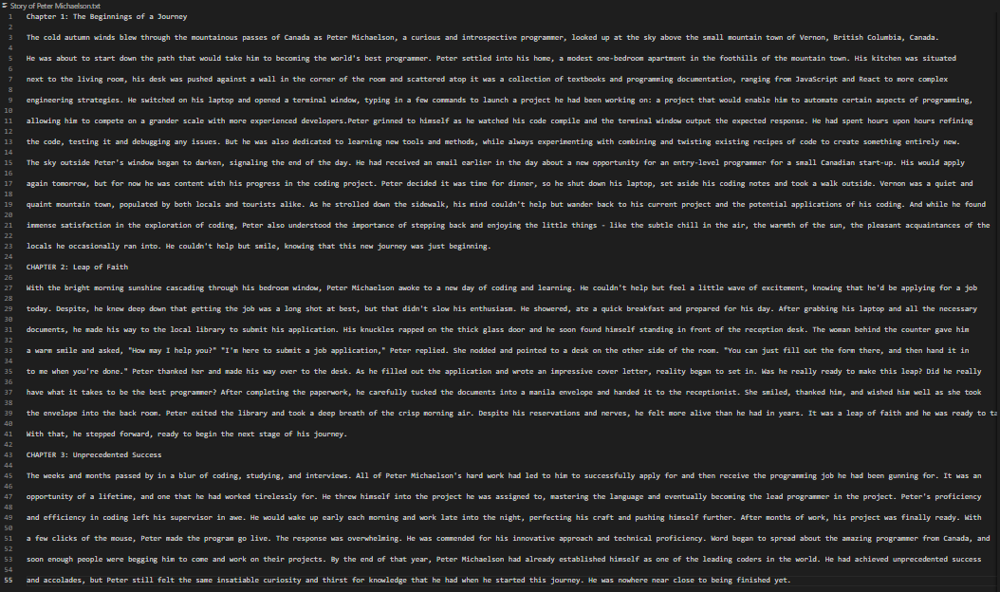

# Write-A-Book-In-A-Day

### Purpose:

The aim of this code is to allow me to write a full novel (of any chapter length) with a few minutes of effort.

### Languages used: 

JavaScript (w/ Node.JS) 

### APIs used:

OpenAI

### How does it work?

All I need to do is provide inputs for the following traits of a novel below, and the code should output a complete book to a .txt or .docx document using OpenAI:

(1) main character name\
(2) main character personality\
(3) main character purpose\
(4) novel starting scenario\
(5) novel setting\
(6) novel plot\
(7) novel lesson\
(8) novel ending\
(9) novel extra information\
(10) number of chapters\
(11) chapter word length

### How long does it take the program complete the book?

After entering inputs, it usually takes the program around 1-3 minutes per 10 chapters outputted. This means that it could take up to a day to complete a novel with thousands of chapters.

### How to run the code?

Just enter "npm run start" in your console. Make sure to create a ".env" file and store the required keys and inputs there. You can copy the required .env variables from the "emptyEnvVars.MD" file. Non-string values can be inputted as strings for the .env variables because they're parsed afterwards.

### Live Demo:

By entering the API key and sample inputs found in the "sampleEnvVarInput.md" file, these are the type of chapters you could expect. Be aware that if you ran the code and entered this exact same input, besides the general provided outlines, the output would be unique since the book is written using AI.

  

